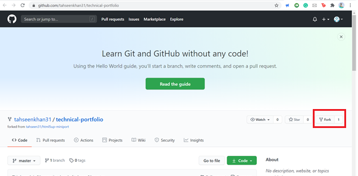
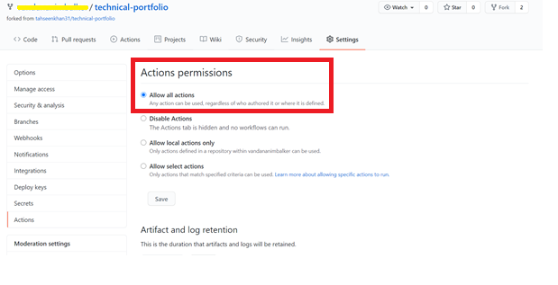
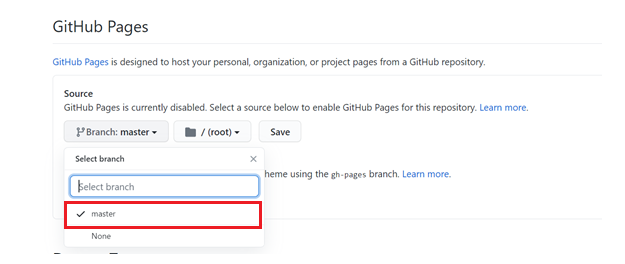
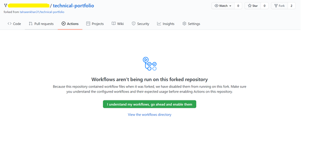
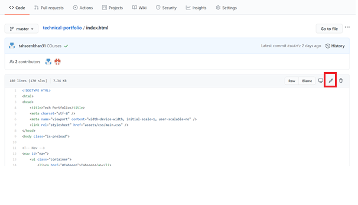
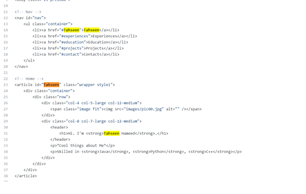
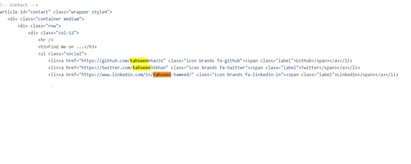
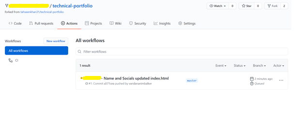
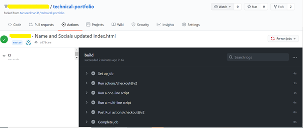

# Build your own Technical Portfolio

This repository allows you to create your own technical portfolio page! You are welcome to extend it for other uses.

## Tutorial prerequisites
* [A GitHub Account](https://github.com/signup)

## Fork and configure the portfolio template repository

Navigate to the [tech-portfolio](https://github.com/tahseenkhan31/technical-portfolio) in your web browser.

Fork this repo to your GitHub user.

This repo contains all of the necessary files to deploy your technical portfolio; however, you need to configure this repository with the necessary settings.

**NOTE** Ensure you are on your forked repository by checking the upper left title of the repo. It should contain your GitHub user name.

Navigate to Settings in your forked repo.

In the Settings page, navigate to "Actions" and ensure “Allow all actions” is enabled.

On the Settings page, navigate to "Options" and scroll to the bottom to the "GitHub Pages" section.

Change the Source branch to "gh-pages" and keep the "/(root)" path and save this change. This contains the GitHub Actions workflow.

Go to the Actions page of the repostiory.

GitHub disables workflows when you fork them by default. To enable this pre-configured workflow, select the "I understand my workflows, go ahead and enable them."

Now you may make changes to make this repo your own

## Edit your portfolio with your personal info

Navigate to the Code page of your repo and open the `index.html` file.

Click on the pencil icon to edit this file.

There are four text fields and three social media links for you to update.

### Update with your name 

Replace your Name in Navigation Bar

Replace your name in Home container

Modify The Paragraph in Home container to Describe yourself.

### Update your social media links

Scroll to the bottom of the `index.html` file in the editor.

Update with your Twitter, GitHub & Linkedin urls.

To find your LinkedIn public profile name, login to your LinkedIn account and view your profile.

On your profile page, click "Edit public profile & URL" from the upper right section of the page.

Under "Edit your custom URL" copy the text after the `https://www.linkedin.com/in/` portion of the URL. This is your LinkedIn username.

Once you have updated all of the above fields, you are ready to commit these initial changes.

Click the "Commit changes" button to save your changes.

## Review the Actions workflow

To observe GitHub Actions building your page, go the "Actions" section of the repo.

Click on the "Update siteConfig.js" job. GitHub displays the actions it is taking to build & publish your portfolio.

When the "build" job is complete, navigate to your portfolio in another tab of your web browser.

Your URL is "https://YOUR-GITHUB-USERNAME.github.io/tech-portfolio/" and this site displays your live portfolio.

Congratulations! You completed this walkthrough and have a live technical portfolio! Any changes in your forked repo will trigger a new build and will update your site.

